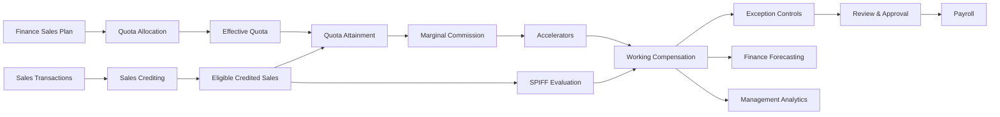
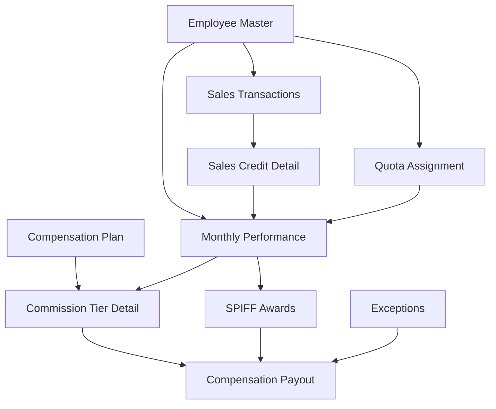

# Sales Compensation & Incentive Analytics

> **Portfolio simulation of an end-to-end sales compensation analytics and administration process.**  
> This project uses **synthetic data** and fictional business rules. It does **not** represent the actual compensation plan, internal data, or operating practices of Staples Canada or any other employer.

---

## Project Status

**Core analytical build: Complete**

Completed scope includes:

- quota allocation and effective quota calculations
- transaction-level sales crediting
- quota attainment
- marginal commission calculations
- accelerator economics
- Q3 Technology Services SPIFF
- exception controls and payroll reconciliation
- quota coverage vs. Finance plan
- commission expense forecasting
- compensation-plan effectiveness analysis
- consolidated Excel portfolio model
- Power BI semantic-model design
- management insights and recommendations

Power BI visualization screenshots can be added to the repository once the report is built in Power BI Desktop.

---

# Executive Summary

Sales compensation sits at the intersection of **Sales, Finance, Payroll, HR/Total Rewards, Sales Operations, and Analytics**.

The central challenge is not simply calculating a commission percentage. A compensation process must reliably translate:

**sales transactions → credited performance → quota attainment → incentive rules → employee payout → payroll approval → financial reporting**

while also answering questions such as:

- How much should each salesperson be paid?
- Can every dollar of the payout be explained?
- Are sales credits and quotas valid?
- How much will the compensation plan cost under different performance scenarios?
- Does the incentive structure meaningfully differentiate performance?
- Is quota capacity sufficient to support the financial plan?
- Are SPIFFs and accelerators creating financially manageable incentive costs?

This project models that process for a fictional Canadian B2B sales organization and creates a simplified compensation administration and analytics system.

---

# Business Problem

A Sales Compensation team needs to convert raw commercial activity into accurate and auditable incentive payments.

That requires solving three connected business problems.

## 1. Compensation Administration

> **How much should each salesperson be paid?**

The process must combine:

- approved quota
- eligible credited sales
- quota attainment
- marginal commission tiers
- accelerators
- SPIFFs
- adjustments
- employee and plan eligibility

## 2. Financial Control

> **Can the payment be trusted?**

The compensation process must detect issues such as:

- duplicate transactions
- invalid employees
- transactions after termination
- missing quota
- missing compensation-plan assignments
- unknown product categories
- unusual negative transactions
- extreme attainment
- unreconciled payroll amounts

## 3. Management Analytics

> **What do compensation results tell management?**

Management needs visibility into:

- quota attainment distribution
- compensation expense
- accelerator cost
- quota coverage
- payout concentration
- SPIFF economics
- commission forecasting
- incentive effectiveness

---

# Fictional Business Scenario

The project models a fictional company called:

## Northstar Workplace Solutions Canada

A Canadian B2B organization selling:

- office and workplace products
- technology hardware
- furniture
- Technology Services
- related business solutions

The modeled quota-carrying sales organization contains:

| Metric | Value |
|---|---:|
| Sales Representatives | 48 |
| Sales Managers | 8 |
| Regions | 4 |
| Finance Annual Sales Plan | $60.0M |
| Gross Approved Quota Book | $63.0M |
| Gross Quota Coverage | 105% |

Sales roles include:

- Account Executive I
- Account Executive II
- Senior Account Executive

Individual quotas vary by territory while maintaining the approved organization-level quota book.

---

# Compensation Plan Design

The fictional commission plan uses **marginal commission tiers**.

| Quota Attainment | Commission Rate | Component |
|---|---:|---|
| 0%–80% | 1.0% | Base Commission |
| 80%–100% | 2.0% | Base Commission |
| 100%–110% | 3.5% | Accelerator |
| >110% | 5.0% | Accelerator |

The plan is **uncapped**.

Attainment above **175%** is not capped, but it is automatically flagged for review.

## Why Marginal Tiers?

Only the sales dollars inside each attainment band receive that band's commission rate.

For a rep with a **$100,000 quota** and **120% attainment**:

- first $80,000 × 1% = $800
- next $20,000 × 2% = $400
- next $10,000 × 3.5% = $350
- final $10,000 × 5% = $500

Total commission:

**$2,050**

The 5% rate is **not** applied retroactively to all sales.

---

# Q3 Technology Services SPIFF

The model also includes a temporary Technology Services incentive.

### SPIFF Period

**July 1 – September 30**

### Target

Each eligible rep receives a Technology Services target equal to:

**12% × Effective Q3 Sales Quota**

### Award Tiers

| TSVC Target Attainment | Award |
|---|---:|
| <80% | $0 |
| 80%–99.99% | $250 |
| 100%–119.99% | $600 |
| 120%+ | $1,000 |

The highest achieved tier is paid.

The SPIFF is modeled separately from core commission so its cost and effectiveness can be analyzed independently.

---

# End-to-End Compensation Process



---

# Data Model

The project separates raw source activity, business rules, calculated results, and controls.



A key modeling principle is **grain discipline**.

Examples:

- one sales transaction per row
- one employee × month performance record
- one employee × month × commission tier record
- one exception per issue
- one compensation component per payout record

Mixing these grains would make reconciliation and auditability difficult.

---

# Sales Crediting

Raw revenue is not automatically commissionable revenue.

| Transaction Condition | Treatment |
|---|---|
| Valid invoiced commissionable sale | Eligible |
| Valid processed return | Eligible negative credit |
| Shipping / delivery | Excluded |
| Sales tax | Excluded |
| Cancelled transaction | Excluded |
| Duplicate Transaction ID | HOLD |
| Invalid Employee ID | HOLD |
| Transaction after termination | HOLD |
| Unknown product category | HOLD |
| Negative revenue classified as Sale | Review |
| Outside compensation period | Review |

The model preserves the original transaction and records how Sales Compensation treated it rather than deleting or silently changing suspicious records.

---

# Effective Quota

Annual quota alone is not always the correct employee performance denominator.

**Nominal Monthly Quota = Annual Quota × Monthly Seasonality**

Then:

**Effective Monthly Quota = Nominal Monthly Quota × Active-Day Factor × Ramp Factor**

New-hire ramp rules:

| Period | Ramp Factor |
|---|---:|
| Hire month | 50% |
| Second month | 75% |
| Third month onward | 100% |

The hire month can also be prorated for active days.

---

# Quota Attainment

**Quota Attainment = Eligible Credited Sales ÷ Effective Monthly Quota**

The model separates performance from processing status.

Performance examples:

- Below 80%
- 80%–99.99%
- 100%–109.99%
- 110%–174.99%
- 175%+ Review

Processing examples:

- Ready for Commission Calculation
- HOLD — Quota
- HOLD — Sales Credit
- Review — Sales Credit
- Review — High Attainment
- Not Applicable

---

# Commission Traceability

The model stores commission at the **tier level** so every payout can be reconstructed.

## Example — Maya Chen, August 2026

| Metric | Value |
|---|---:|
| Effective Quota | $85,400 |
| Eligible Sales | $100,772 |
| Attainment | 118% |

| Tier | Sales in Tier | Rate | Commission |
|---|---:|---:|---:|
| 0%–80% | $68,320 | 1.0% | $683.20 |
| 80%–100% | $17,080 | 2.0% | $341.60 |
| 100%–110% | $8,540 | 3.5% | $298.90 |
| >110% | $6,832 | 5.0% | $341.60 |

Base commission:

**$1,024.80**

Accelerator commission:

**$640.50**

Total working commission:

**$1,665.30**

---

# Compensation Controls

A mathematically correct result is not automatically payroll-ready.

The model identifies exceptions such as:

- missing quota
- missing compensation-plan assignment
- duplicate transactions
- invalid employee IDs
- post-termination sales
- unknown product categories
- negative sales requiring review
- extreme quota attainment

The modeled approval lifecycle is:

**Calculated → Exception / Hold → Reviewed → Approved → Sent to Payroll**

Approval is treated as a human governance decision rather than something the formula automatically decides.

---

# Important Control Example

One employee's January commission was mathematically calculated correctly.

However, the employee's compensation-plan assignment did not begin until February.

The downstream control layer therefore changed the January result to:

**HOLD — Missing Plan**

This demonstrates:

> **A correct formula can still produce an administratively invalid payment if eligibility and effective dating are not controlled.**

---

# Payroll Reconciliation

The compensation process reconciles:

**Working Compensation = Approved Amount + Held / Review Amount**

The modeled payroll reconciliation difference is:

**$0**

Held amounts remain visible rather than disappearing from reporting.

---

# Quota Coverage vs Finance Plan

The organization begins with:

- Finance plan: **$60.0M**
- Gross quota book: **$63.0M**
- Gross coverage: **105%**

After quota effective dating:

**Nominal quota in force ≈ $58.92M**

After new-hire ramping and active-day proration:

**Effective operational quota ≈ $58.39M**

Effective quota coverage becomes:

**≈97.3%**

---

# Commission Expense Forecasting

| Scenario | Attainment | Forecast Sales | Forecast Commission |
|---|---:|---:|---:|
| Downside | 90% | ~$52.55M | ~$583.9K |
| Plan | 100% | ~$58.39M | ~$700.7K |
| Upside | 110% | ~$64.23M | ~$905.1K |
| High Upside | 120% | ~$70.07M | ~$1.197M |

A key Finance insight is that compensation expense is **nonlinear**.

From 100% to 110% attainment:

- sales increase ≈ **10%**
- commission expense increases ≈ **29%**

From 100% to 120%:

- sales increase ≈ **20%**
- commission expense increases ≈ **71%**

---

# Accelerator Economics

Total working core commission:

**≈$865K**

Incremental accelerator premium versus continuing a 2% rate above quota:

**≈$115K**

This separates total commission on above-quota sales from the **incremental cost created by the accelerator rates themselves**.

---

# SPIFF Economics

| Metric | Result |
|---|---:|
| SPIFF-Eligible Reps | 46 |
| Award Recipients | 25 |
| Award Rate | ~54% |
| Eligible TSVC Sales | ~$1.70M |
| SPIFF Cost | $18,500 |
| SPIFF Cost / TSVC Sales | ~1.09% |

The analysis describes observed economics and does **not** claim that the SPIFF caused the sales.

---

# Key Business Insights

## 1. The Gross Quota Buffer Was Fully Consumed

The organization started with 105% gross quota coverage but ended with approximately 97.3% effective operational coverage.

**Management implication:** track effective quota capacity monthly rather than relying only on the annual gross quota book.

## 2. Rep Overperformance Offset the Capacity Gap

Eligible credited sales reached approximately **$60.79M**, slightly above the modeled **$60M Finance plan**, despite effective quota capacity being below plan.

**Management implication:** strong performance is positive, but sustained overachievement should not be treated as a substitute for restoring quota capacity.

## 3. Coverage Risk Is Uneven by Region

The model shows materially different effective coverage levels by region.

**Management implication:** investigate staffing, vacancies, termination timing, ramping, and quota effective dates before interpreting low coverage as poor sales execution.

## 4. Finance Should Forecast Using the Actual Payout Curve

Accelerators create nonlinear compensation expense.

**Management implication:** forecast compensation using attainment scenarios or attainment distributions rather than one historical average commission rate.

## 5. Accelerators Are a Meaningful Cost of Overperformance

The incremental accelerator premium is approximately **$115K**.

**Management implication:** evaluate accelerator expense against incremental contribution margin and strategic value.

## 6. The SPIFF Has Bounded Cost

The Q3 SPIFF costs approximately **1.09% of targeted Technology Services sales**.

**Management implication:** combine future SPIFF analysis with product margin and stronger pre/post or comparison-group analysis.

## 7. Compensation Controls Have Financial Impact

The model detects **13 exceptions** and approximately **$19K of compensation remains blocked or under review** in the simulated approval process.

**Management implication:** monitor exception aging and recurring root causes to reduce payout delays and manual investigation.

## 8. The Plan Shows Strong Pay-for-Performance Differentiation

Higher quota attainment produces systematically richer payout economics.

**Management implication:** preserve differentiation while also monitoring quota and territory fairness.

---

# Excel Portfolio Model

The consolidated Excel model is organized as an interview walkthrough:

```text
00_Dashboard
01_Model_Guide
02_Rules
03_Quota_Coverage
04_Sales_Credit
05_Perf_Comm
06_SPIFF
07_Controls
08_Forecast
09_Effectiveness
10_Traceability
11_Business_Insights
12_Management_Actions
```

---

# Power BI Design

The project also includes a Power BI-ready semantic model.

### Dimensions

- Dim Employee
- Dim Date
- Dim Product Category
- Dim Scenario

### Fact Tables

- Fact Sales Credit
- Fact Monthly Performance
- Fact SPIFF
- Fact Exceptions
- Fact Payroll
- Fact Forecast Monthly

The report is designed around four pages.

## Page 1 — Executive Overview

- Eligible Credited Sales
- Effective Quota
- Weighted Attainment
- Working Commission
- Approved Compensation
- Effective Coverage
- Open Exceptions
- monthly sales vs quota
- attainment distribution
- working vs approved compensation

## Page 2 — Performance & Compensation

- attainment vs commission scatterplot
- employee performance matrix
- base vs accelerator commission
- attainment distribution
- rep-level drillthrough

## Page 3 — Controls & Payroll

- critical exceptions
- review exceptions
- blocked compensation
- approval rate
- exceptions by type
- payroll reconciliation
- operational exception register

## Page 4 — Finance & Incentives

- quota coverage by region
- 90% / 100% / 110% / 120% forecast scenarios
- accelerator premium
- forecast commission rate
- SPIFF economics

---

# Screenshot Placeholders

### Excel Dashboard

```text
[Insert Excel dashboard screenshot here]
```

### Power BI Executive Overview

```text
[Insert Power BI Executive Overview screenshot here]
```

### Power BI Performance & Compensation

```text
[Insert Power BI Performance & Compensation screenshot here]
```

### Power BI Controls & Payroll

```text
[Insert Power BI Controls & Payroll screenshot here]
```

### Power BI Finance & Incentives

```text
[Insert Power BI Finance & Incentives screenshot here]
```

---

# Technology Stack

### Excel

Used for:

- business-rule modeling
- quota calculations
- transaction validation
- commission calculations
- reconciliation
- forecasting
- management analysis

### Power BI

Designed for:

- executive reporting
- employee performance analysis
- incentive economics
- exception monitoring
- Finance forecasting

### SQL / Data Modeling Concepts

The project applies:

- dimension/fact separation
- table grain
- effective dating
- keys and relationships
- audit-detail preservation
- star-schema reporting design

### GitHub

Used to document:

- business problem
- methodology
- project architecture
- analytical decisions
- assumptions
- limitations
- portfolio outputs

---

# Suggested Repository Structure

```text
sales-compensation-analytics/
│
├── README.md
├── .gitignore
│
├── data/
│   ├── README.md
│   └── synthetic/
│       └── sales_compensation_synthetic_data.xlsx
│
├── excel/
│   ├── README.md
│   └── sales_compensation_portfolio_model.xlsx
│
├── powerbi/
│   ├── README.md
│   ├── sales_compensation_powerbi_data_model.xlsx
│   └── screenshots/
│       └── README.md
│
├── docs/
│   ├── business_rules.md
│   ├── data_dictionary.md
│   ├── methodology.md
│   ├── key_insights.md
│   └── interview-walkthrough.md
│
└── images/
    ├── README.md
    └── business_insights.png
```

---

# How to Explore the Project

1. Read the **Business Problem** and **Executive Summary**.
2. Review the compensation plan and sales-credit rules.
3. Open the consolidated Excel workbook.
4. Start on the executive dashboard.
5. Follow quota → sales credit → performance → commission → controls.
6. Review forecasting and management insights.
7. Open the Power BI report or screenshots for the visualization layer.

---

# Key Analytical Principles Demonstrated

### Grain

Every table has a clearly defined row-level meaning.

### Traceability

Calculated outputs can be traced back to source transactions and rules.

### Effective Dating

Employee, quota, hierarchy, and plan assignments can change over time.

### Reconciliation

Calculated compensation is reconciled to approved and payroll-ready amounts.

### Separation of Calculation and Approval

A mathematically correct number is not automatically an authorized payment.

### Scenario Analysis

Plan rules are translated into forward-looking financial forecasts.

### Descriptive vs Causal Analysis

Observed incentive economics are analyzed without claiming that an incentive caused the observed performance.

---

# Project Limitations

This project intentionally simplifies real-world compensation administration.

Not modeled in detail:

- split sales credit
- multi-currency compensation
- annual true-ups
- draws
- complex clawbacks
- multi-measure incentive plans
- payroll tax
- complex territory changes
- customer-level profitability
- contribution margin
- quota difficulty / territory potential
- causal incentive-effectiveness experiments

The dataset is synthetic.

Therefore the project should be presented as:

> **a portfolio simulation demonstrating compensation analytics, controls, business reasoning, Excel modeling, and Power BI design**

rather than as professional compensation-administration experience.

---

# Interview Explanation

> “I wanted to understand sales compensation beyond simply calculating commission percentages, so I built a portfolio simulation of the monthly compensation process. I modeled employee and quota assignments, transaction-level sales performance, sales-credit rules, quota attainment, marginal commissions and accelerators, a short-term SPIFF, exception controls, quota rollups against a Finance plan, compensation-expense forecasting, and plan-effectiveness analysis. I also designed a Power BI reporting model for executive, performance, control, and Finance views. The project is not professional sales-compensation administration experience, but it helped me understand how sales results and plan rules translate into auditable employee payouts and financial reporting.”

---

# Disclaimer

This repository is an independent portfolio project.

- All business entities are fictional.
- All employee names and transactions are synthetic.
- Compensation rules were created solely for the project.
- The project does not disclose or represent any employer's confidential compensation plans, sales data, quota methodology, or internal systems.
